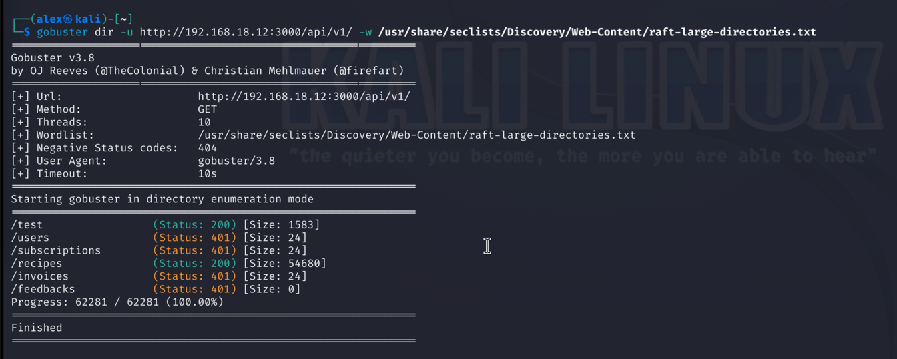

# Recon of Munchora

**Preparations**

For local testing of Munchora (don’t use production — it has strict rate limits),
enter the `soft-dev-02-databases project`,
then enter `soft-dev-02-databases` project and start it by running `make dev`,
then find real machines local IP by `ipconfig getifaddr en0`
and now use that local IP for recon and other stuff from _Kali machine_.

```bash
# Find local machine IP which is the victim IP
ipconfig getifaddr en0
```

Happy xploit!

## Domain / OSINT reconnaissance

### Google search

Search for sensitive pages, config files, or credentials accidentally exposed:

```text
site:munchora.pro "login"
site:munchora.pro filetype:env
```

### Subdomain enumeration

Tools: _sublist3r_, _amass_, _assetfinder_

Example:

```bash
amass enum -d munchora.pro
```

---

<br>

### Gobuster directory and endpoint brute forcing

**Network Binding for Local Development**

_To make it work where Rails server is running locally with mac but accessible for VMWare Kali machine:_

Web servers often default to 127.0.0.1 (localhost-only binding),
blocking external access from VMs or other machines.

Use -b 0.0.0.0 to bind to all network interfaces, making the app accessible via machine's IP address.
This allows security tools in VMs to scan locally hosted applications during development and testing.
Fix by running rails server this way: `bin/rails server -b 0.0.0.0`

```
gobuster dir -u http://192.168.18.12:3000/api/v1 -w /usr/share/seclists/Discovery/Web-Content/common-api-endpoints-mazen160.txt
```



---

<br>

### DNS recon

_dig_, _nslookup_, host to check A/AAAA, MX, TXT, and CNAME records.

Detect third-party services, email providers, or misconfigured domains.

### WHOIS / SSL info

_WHOIS_ for ownership and registrar info.

Check _SSL certs_ with:

```bash
nmap --script ssl-cert -p 443 munchora.pro
Starting Nmap 7.95 ( https://nmap.org ) at 2025-10-09 19:48 CEST
Nmap scan report for munchora.pro (139.162.157.131)
Host is up (0.024s latency).
rDNS record for 139.162.157.131: 139-162-157-131.ip.linodeusercontent.com

PORT    STATE SERVICE
443/tcp open  https
| ssl-cert: Subject: commonName=munchora.pro
| Subject Alternative Name: DNS:munchora.pro, DNS:www.munchora.pro
| Issuer: commonName=E5/organizationName=Let's Encrypt/countryName=US
| Public Key type: ec
| Public Key bits: 256
| Signature Algorithm: ecdsa-with-SHA384
| Not valid before: 2025-08-18T20:53:42
| Not valid after:  2025-11-16T20:53:41
| MD5:   1ba0:7a4d:a7a6:b099:afe8:1e8b:aba8:31f3
|_SHA-1: dc59:cd16:d38a:7269:e514:d21a:8973:de98:7578:e6b3

Nmap done: 1 IP address (1 host up) scanned in 0.32 seconds
```

✅ **Key takeaways**
- HTTPS is active on port 443.
- The certificate is valid, trusted, and covers both `munchora.pro` and `www.munchora.pro`.
- Uses strong modern crypto (ECDSA-256 + SHA384).
- Keep renewal automated — Let’s Encrypt certs expire quickly.
- No warnings about weak keys or expired certs — everything looks healthy.

---

## Network & port scanning (nmap)

# Nikto scan

Nikto is an aggressive web scanner for common misconfigurations and known vulnerabilities.

```bash
nikto -h https://munchora.pro -o nikto-munchora.txt
- Nikto v2.5.0
---------------------------------------------------------------------------
+ Target IP:          139.162.157.131
+ Target Hostname:    munchora.pro
+ Target Port:        443
---------------------------------------------------------------------------
+ SSL Info:        Subject:  /CN=munchora.pro
                   Ciphers:  TLS_AES_256_GCM_SHA384
                   Issuer:   /C=US/O=Let's Encrypt/CN=E5
+ Start Time:         2025-10-09 19:24:22 (GMT2)
---------------------------------------------------------------------------
+ Server: nginx
+ /: The anti-clickjacking X-Frame-Options header is not present. See: https://developer.mozilla.org/en-US/docs/Web/HTTP/Headers/X-Frame-Options
+ /: The site uses TLS and the Strict-Transport-Security HTTP header is not defined. See: https://developer.mozilla.org/en-US/docs/Web/HTTP/Headers/Strict-Transport-Security
+ /: The X-Content-Type-Options header is not set. This could allow the user agent to render the content of the site in a different fashion to the MIME type. See: https://www.netsparker.com/web-vulnerability-scanner/vulnerabilities/missing-content-type-header/
+ No CGI Directories found (use '-C all' to force check all possible dirs)
+ /robots.txt: contains 1 entry which should be manually viewed. See: https://developer.mozilla.org/en-US/docs/Glossary/Robots.txt
+ /: The Content-Encoding header is set to "deflate" which may mean that the server is vulnerable to the BREACH attack. See: http://breachattack.com/
+ /sitemap.xml: This gives a nice listing of the site content.
+ /admin/: This might be interesting.
+ /home/: This might be interesting.
+ /Admin/: This might be interesting.
+ /api.php?t_path_core=http://blog.cirt.net/rfiinc.txt?&cmd=id: Uncommon header 'x-runtime' found, with contents: 0.075342.
+ /api.php?t_path_core=http://blog.cirt.net/rfiinc.txt?&cmd=id: Uncommon header 'x-request-id' found, with contents: 3f9e4286-55f9-4766-be07-ac8204b84852.
+ /_profiler/: Symfony Profiler may reveal sensitive application information.
+ /#wp-config.php#: #wp-config.php# file found. This file contains the credentials.
+ 7964 requests: 0 error(s) and 13 item(s) reported on remote host
+ End Time:           2025-10-09 19:44:51 (GMT2) (1229 seconds)
---------------------------------------------------------------------------
```

[checkout generated nikto scan file](assets/nikto-munchora.txt)

---

<br>

Goal: Discover open ports, services, and OS info on your server.

### Nmap workflow

**_nmap using UDP ports using flag_** `-sU`

If the firewall blocks incoming _ICMP (ping) requests_, _Nmap_ may skip hosts it thinks are offline. Adding the `-Pn`
flag forces _Nmap_ to scan even when ping responses are blocked.

```bash
nmap -sU munchora.pro
Starting Nmap 7.95 ( https://nmap.org ) at 2025-10-09 18:20 CEST
Nmap scan report for munchora.pro (139.162.157.131)
Host is up (0.021s latency).
rDNS record for 139.162.157.131: 139-162-157-131.ip.linodeusercontent.com
All 1000 scanned ports on munchora.pro (139.162.157.131) are in ignored states.
Not shown: 1000 open|filtered udp ports (no-response)

Nmap done: 1 IP address (1 host up) scanned in 4.36 seconds

# Adding the Pn flag to force scan if no ping response
nmap -Pn -sU -p 1-1024 munchora.pro
Starting Nmap 7.95 ( https://nmap.org ) at 2025-10-09 18:24 CEST
Nmap scan report for munchora.pro (139.162.157.131)
Host is up.
rDNS record for 139.162.157.131: 139-162-157-131.ip.linodeusercontent.com
All 1024 scanned ports on munchora.pro (139.162.157.131) are in ignored states.
Not shown: 1024 open|filtered udp ports (no-response)

Nmap done: 1 IP address (1 host up) scanned in 207.55 seconds
```

---

Checkout [NMAP_SCANS for even more scans](NMAP_SCANS.md)

---

**_nmap OS detection_**

`-O` = “Tell me what OS this is.”

`-A` = “Tell me everything you can about this host and its services.”

```bash
# ===================================================================================================
# using -O
sudo nmap -O -p1-100 munchora.pro
[sudo] password for alex: 
Starting Nmap 7.94SVN ( https://nmap.org ) at 2025-09-25 13:49 CEST
Nmap scan report for munchora.pro (139.162.157.131)
Host is up (0.026s latency).
rDNS record for 139.162.157.131: 139-162-157-131.ip.linodeusercontent.com
Not shown: 98 filtered tcp ports (no-response)
PORT   STATE SERVICE
22/tcp open  ssh
80/tcp open  http
Warning: OSScan results may be unreliable because we could not find at least 1 open and 1 closed port
OS fingerprint not ideal because: Missing a closed TCP port so results incomplete
No OS matches for host

OS detection performed. Please report any incorrect results at https://nmap.org/submit/ .
Nmap done: 1 IP address (1 host up) scanned in 6.01 seconds

# ===================================================================================================
# using -A
nmap -A -p1-100 munchora.pro
Starting Nmap 7.95 ( https://nmap.org ) at 2025-10-09 18:43 CEST
Nmap scan report for munchora.pro (139.162.157.131)
Host is up (0.011s latency).
rDNS record for 139.162.157.131: 139-162-157-131.ip.linodeusercontent.com
Not shown: 98 filtered tcp ports (no-response)
PORT   STATE SERVICE VERSION
22/tcp open  ssh     OpenSSH 9.6p1 Ubuntu 3ubuntu13.11 (Ubuntu Linux; protocol 2.0)
| ssh-hostkey: 
|   256 f6:c4:7f:4d:10:87:6d:e1:f4:57:55:6f:02:b2:28:f8 (ECDSA)
|_  256 88:fe:de:c3:2f:91:5d:be:20:6e:07:37:79:34:4a:5b (ED25519)
80/tcp open  http    nginx
|_http-title: Welcome to nginx!
Warning: OSScan results may be unreliable because we could not find at least 1 open and 1 closed port
Aggressive OS guesses: Linux 4.15 - 5.19 (97%), Linux 5.0 - 5.14 (97%), MikroTik RouterOS 7.2 - 7.5 (Linux 5.6.3) (97%), Linux 2.6.32 - 3.13 (92%), Linux 3.10 - 4.11 (92%), Linux 3.2 - 4.14 (92%), Linux 3.4 - 3.10 (92%), Linux 4.15 (92%), Linux 2.6.32 - 3.10 (92%), Linux 4.19 (91%)
No exact OS matches for host (test conditions non-ideal).
Network Distance: 2 hops
Service Info: OS: Linux; CPE: cpe:/o:linux:linux_kernel

TRACEROUTE (using port 80/tcp)
HOP RTT     ADDRESS
1   4.58 ms dsldevice.lan (192.168.18.1)
2   4.61 ms 139-162-157-131.ip.linodeusercontent.com (139.162.157.131)

OS and Service detection performed. Please report any incorrect results at https://nmap.org/submit/ .
Nmap done: 1 IP address (1 host up) scanned in 17.22 seconds
```

----

### ChatGPT - Summary — Nmap findings for munchora.pro

1. Limited TCP exposure: **ports 22 (OpenSSH 9.6p1)**, **80 (nginx)** and **443** were open;
   most other TCP ports reported as filtered.
2. UDP scans returned mostly **open|filtered (no-response)**; **UDP 161 (SNMP)** showed as open|filtered — verify or
   block if
   unused.
3. Service detection revealed the **default nginx welcome page** (information leakage) and SSH host keys; rDNS points to
   a
   **Linode VM**.
4. OS fingerprinting suggests **Linux (kernel ~4.x–5.x)** but was inconclusive due to limited open/closed ports.
5. Actionable takeaways: restrict/ACL SSH, disable or firewall SNMP, enable HTTPS (remove default nginx page), and keep
   firewall rules tuned (use `-Pn` when ICMP is blocked).

