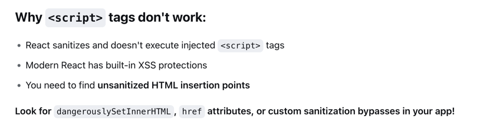
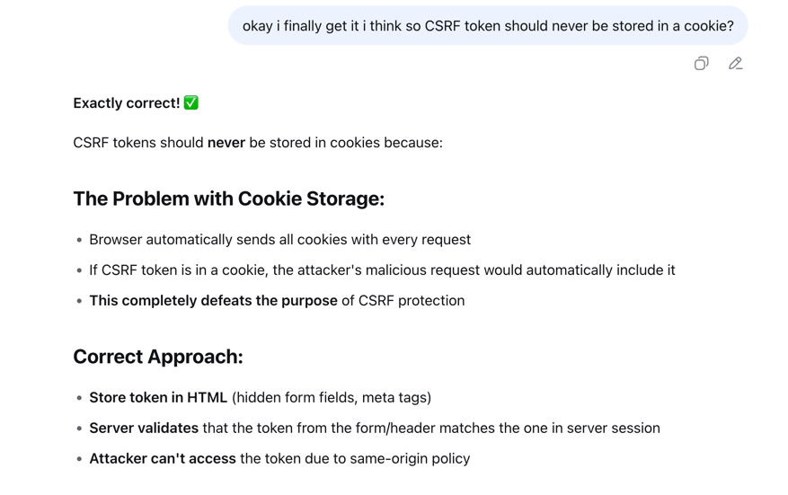
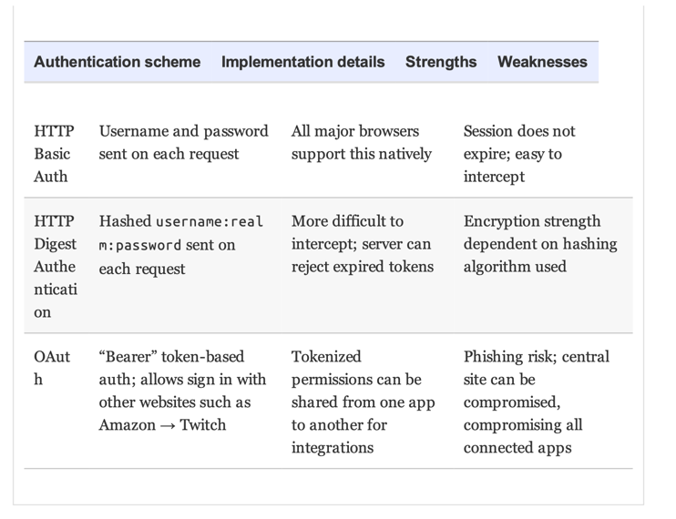
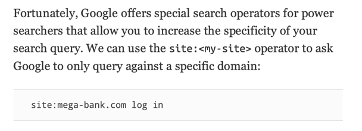
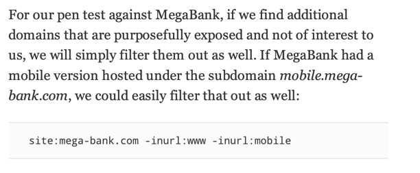

# Elective Security for Web Developers

Common problems are in AAA: Authentication, Authorization, Accounting / Auditing.

## CVE vs CWE

### CVE - Common Vulnerabilities and Exposures

- Definition: Public identifier for known cybersecurity vulnerabilities.
- Format: CVE-YYYY-NNNNN (year + unique number).
- Purpose: Standard way to track, share, and reference vulnerabilities across tools and databases.
- Authority: Managed by MITRE, used globally.
- Usage: Security teams use CVEs to patch, monitor, and mitigate risks quickly.
- Severity: Often paired with CVSS scores for impact rating.

---

### CWE Common Weakness Enumeration

- It’s a catalog of software and hardware weaknesses (like insecure coding patterns, design flaws, and
  misconfigurations).
- Managed by MITRE, used worldwide.
- Each weakness has a unique CWE-ID (e.g., CWE-89: SQL Injection).
- Helps developers, testers, and security teams:
    - Classify vulnerabilities (root causes, not just exploits).
    - Prioritize fixes.
    - Map to CVEs (CWE = weakness, CVE = actual instance in a product).

---

### Key difference

**_CWE_** → describes the type of flaw (general category).

**_CVE_** → documents a specific vulnerability in a product/version.

---

<br>

## Cryptography

_Kerckhoffs’s principle_ is a foundational rule in cryptography

`A cryptosystem should remain secure even if everything about the system,
except the secret key, is public knowledge.`

---

<br>

## SQL Injection

For juiceshop if the following is inserted into username/email field login is approved: `' or '1'='1' --`

```javascript
const user_id = '1=1'

const user_id = '123abc; DROP TABLE users;';

const user_id = '123abd; UPDATE users SET credits = 10000 WHERE user = 123abd;'
```

In the injection world, SQL injection is just a subset of “injection"-style attacks.
SQL injection is categorized as injection because it involves an
interpreter (the SQL interpreter) being targeted by a payload that is
read into the interpreter as a result of improper sanitization,
which should allow only specific parameters from the user to be read into the interpreter

---

<br>

## Finding third party dependencies for a given web app

The following script makes use of built-in DOM traversal func to quickly generate a list of each script tag imported
into current page.

Go to a website open developer tools in browser, go to console and execute the following code to get all third part
dependencies logged:

```javascript
const scripts = document.querySelectorAll('script');

scripts.forEach(script => {
  if (script.src) {
    console.log(`i: ${script.src}`);
  }
});
```

---

<br>

## ChatGPT on Mediator, Interpreter and Translator

### Mediator 🕹

_ComputerScience_: A design pattern/component that manages communication between modules so they don’t talk to each
other directly.

_Cybersecurity_: Can be a security control/proxy (e.g., WAF, message broker) that regulates interactions to reduce
attack surface.

### Interpreter 📜

CS: Executes code line-by-line without compiling to machine code first (e.g., Python interpreter).

Cybersecurity: A target for injection attacks (e.g., SQL interpreter, command interpreter in shells).

### Translator 🌐

_ComputerScience_: Converts code/data from one representation to another (e.g., compiler translates source code →
machine code, protocol translators).

_Cybersecurity_: May introduce parsing/format-conversion vulnerabilities (e.g., encoding issues, file format exploits).

---

<br>

## Cross Site Scripting XSS

**_React and XSS_**



_Source Deepseek_

**XSS Types:**

1. **Stored (Persistent)**
    - Malicious script stored on server (database)
    - Affects all users who view the infected page
    - Example: Malicious comment in blog post

2. **Reflected (Non-Persistent)**
    - Payload reflected immediately in response
    - Typically via URL parameters or form inputs
    - Requires user to click malicious link

3. **DOM-based**
    - Entirely client-side, payload never sent to server
    - client JavaScript reads attacker-controllable values from DOM or URL (`location.hash`, `location.search`,
      `location`, `document.referrer`, `cookies`, etc.)
    - JavaScript writes user input directly to DOM
    - Example: document.write(userInput)

4. **Mutation based Xss**

Mutation-based (or mutated) XSS is when seemingly safe or malformed input gets transformed by the browser’s HTML/DOM
parser or DOM APIs into executable code, so a payload that looked harmless at sanitization time ends up running after
the browser “repairs” or mutates the DOM.
It often bypasses server-side filters because they don’t model browser mutation behavior — defend with strict output
encoding, context-aware sanitizers, and a strong Content Security Policy.

**Key Difference:**

- Stored (the code is stored on a database prior to execution)
- Reflected (the code is not stored in a database, but reflected from a link to a user)
- DOM-based (code is both stored and executed in the browser)

---

<br>

## XXE (XML External Entity)

You may think that HTTP endpoints accepting XML is uncommon,
but XML-like formats include SVG, HTML/DOM, PDF (XFDF), and RTF.
These XML-like formats share many common similarities with the XML spec, and as result,
many XML parsers also accept them as inputs.

XXE is often used to compromise files from other users, or to
access files like `/etc/shadow` that store important credentials
required for a Unix-based server to function properly.

- Attacks XML parsers to read local files
- Can lead to file disclosure, SSRF, RCE
- Payload: <!ENTITY xxe SYSTEM "file:///etc/passwd">

**Direct XXE**

In direct XXE, an XML object is sent to the server with an
external entity flag. It is then parsed, and a result is returned
that includes the external entity.
Imagine mega-bank.com has a screenshot utility that allows
you to send screenshots of what is going on in your bank
portal directly to customer support.

**Indirect XXE**

With indirect XXE, as the result of some form of request, the
server generates an XML object. The XML object includes
params provided by the user, potentially leading to the
inclusion of an external entity tag.


---

<br>

### CSRF (Cross-Site Request Forgery)

- Tricks user's browser into making unwanted requests
- Exploits user's active authentication sessions
- Example: Forcing password change via hidden form

#### How CSRF works

_Cross-Site Request Forgery_ (_CSRF_) is an attack that tricks a victim's browser into making unintended requests to a
web application where they're authenticated.
_CSRF_ works because browsers automatically include the user's session cookies with requests to the target site.
An attacker can embed malicious requests in a webpage - such as a form that changes the victim's password or email
address - and when the victim visits that page while logged into the target application, the request executes with their
privileges.

#### How CSRF is prevented

For preventing CSRF attacks it's relevant to talk about cookies `same-site` prop and
browsers security policy called the `Same-Origin Policy (SOP)`.
This policy is the foundational behavior that makes CSRF attacks possible to execute
but also gives developers the tools to prevent them.

**What SOP Blocks** When origins are different, SOP blocks:
- Reading cross-origin DOM (iframe from another site)
- Reading cross-origin AJAX responses
- Reading cross-origin cookies

**But crucially for CSRF: SOP DOES allow SENDING requests to other origins!**

Preventing _CSRF_ primarily involves using _anti-CSRF tokens_.
**These are random, unpredictable values generated by the server and included in _forms_ or _headers_**.
When a state-changing request is made, the server verifies the token matches what was issued to that session.
_SameSite cookies_ provide another layer of defense by restricting when _cookies_ are sent with _cross-site requests_.
For sensitive actions, re-authentication requirements add additional protection by ensuring
the user consciously confirms critical changes.


_source Deepseek_

The below shows how `</img> / <video></video>` tag can be used for CSRF

```html
<!--Unlike a link, an image performs an HTTP GET request right
when it loads
into the DOM. This means it requires no interaction from the
user loading
the webpage.
-->
&amount=10000"
     width="0" height="0" border="0">

<!-- ===================================================== -->

<!-- Videos typically load into the DOM immediately, depending
on the browser's
configuration. Some mobile browsers will not load until the
element is interacted
with.
-->
<video width="1280" height="720" controls>
    <source src="https://www.mega-bank.com/transfer?to_user=<hacker's account>&amount=10000" type="video/mp4">
</video>
```

---

<br>

## Misc

### Dependency vulnerabilities

Using 'bundle-audit' for Ruby on Rails app to check for any insecure gems.

```bash
bundle audit check --update

Updating ruby-advisory-db ...
From https://github.com/rubysec/ruby-advisory-db
 * branch            master     -> FETCH_HEAD
Already up to date.
Updated ruby-advisory-db
ruby-advisory-db:
  advisories:   1033 advisories
  last updated: 2025-11-26 23:11:47 -0800
  commit:       e7530e9589a610c9326fe873979510de7457e5c0
Name: rack
Version: 3.2.0
CVE: CVE-2025-61770
GHSA: GHSA-p543-xpfm-54cp
Criticality: High
URL: https://github.com/rack/rack/security/advisories/GHSA-p543-xpfm-54cp
Title: Rack's unbounded multipart preamble buffering enables DoS (memory exhaustion)
Solution: update to '~> 2.2.19', '~> 3.1.17', '>= 3.2.2'

Name: rack
Version: 3.2.0
CVE: CVE-2025-61771
GHSA: GHSA-w9pc-fmgc-vxvw
Criticality: High
URL: https://github.com/rack/rack/security/advisories/GHSA-w9pc-fmgc-vxvw
Title: Multipart parser buffers large non‑file fields entirely in memory, enabling DoS (memory exhaustion)
Solution: update to '~> 2.2.19', '~> 3.1.17', '>= 3.2.2'

Name: rack
Version: 3.2.0
CVE: CVE-2025-61772
GHSA: GHSA-wpv5-97wm-hp9c
Criticality: High
URL: https://github.com/rack/rack/security/advisories/GHSA-wpv5-97wm-hp9c
Title: Rack's multipart parser buffers unbounded per-part headers, enabling DoS (memory exhaustion)
Solution: update to '~> 2.2.19', '~> 3.1.17', '>= 3.2.2'

Name: rack
Version: 3.2.0
CVE: CVE-2025-61780
GHSA: GHSA-r657-rxjc-j557
Criticality: Medium
URL: https://github.com/rack/rack/security/advisories/GHSA-r657-rxjc-j557
Title: Rack has a Possible Information Disclosure Vulnerability
Solution: update to '~> 2.2.20', '~> 3.1.18', '>= 3.2.3'

Name: rack
Version: 3.2.0
CVE: CVE-2025-61919
GHSA: GHSA-6xw4-3v39-52mm
Criticality: High
URL: https://github.com/rack/rack/security/advisories/GHSA-6xw4-3v39-52mm
Title: Rack is vulnerable to a memory-exhaustion DoS through unbounded URL-encoded body parsing
Solution: update to '~> 2.2.20', '~> 3.1.18', '>= 3.2.3'

Name: uri
Version: 1.0.3
CVE: CVE-2025-61594
Criticality: Unknown
URL: https://www.ruby-lang.org/en/news/2025/10/07/uri-cve-2025-61594
Title: CVE-2025-61594 - URI Credential Leakage Bypass over CVE-2025-27221
Solution: update to '~> 0.12.5', '~> 0.13.3', '>= 1.0.4'

Vulnerabilities found!
```

**_Auth scheme_**



---

### Finding subdomains

- https://archive.org/ -> can be a great tool to lookup through
  sourcecode for a given site which URL schemes are being used.

---

#### Zone Transfer Attacks

A reconnaissance technique targeting misconfigured DNS servers to discover hidden subdomains.
By mimicking authorized _DNS servers_,
attackers request zone transfers - the mechanism DNS uses to synchronize records.

Successful attacks reveal non-public subdomains and DNS configurations without being an actual "hack".
Use `host -t ns target.com` to identify target nameservers.

---

#### Brute Forcing Subdomains

A last-resort reconnaissance technique that tests every possible subdomain combination to discover hidden domains.
It involves generating potential subdomains and asynchronously checking if they resolve to valid IP addresses.

**Key Considerations:**

- Easily detectable and may trigger IP bans
- Slow due to network latency and rate limiting
- Requires asynchronous requests for efficiency
- Should use DNS resolution rather than HTTP requests

**Process**: Generate subdomain guesses → DNS resolve each → Record successful resolutions. Use tools that implement
asynchronous DNS lookups to speed up the process while avoiding detection.

**Dictionary Attacks**

Could also implement Dictionary Attacks where instead of generating all possible subdomains then the most
popular subdomains are chosen from a text file etc.
Just like `Kali 🐲` ships with default `txt` files for plenty _Dictionary Attacks_.

A great tool for this is _**Gobuster**_:

```bash
# Directories/Files
gobuster dir -u http://site.com -w directory-wordlist.txt

# Endpoints (use API-specific wordlists)
gobuster dir -u http://site.com -w /usr/share/wordlists/SecLists/Discovery/Web-Content/common-api-endpoints-mazen160.txt

# Subdomains (different command)
gobuster dns -d site.com -w /usr/share/wordlists/dirbuster/directory-list-2.3-medium.txt
```

---

#### Google subdomains





---

<br>

## TOOLS ⚒️

### ZAP Proxy (by OWASP)

free, open-source web app security scanner.

Acts as a proxy between browser & app.

Lets you intercept, inspect, modify HTTP(S).

Supports scanning, fuzzing, automation.

A free alternative to _Burp Suite_.

---

### Linux Kali 🐉

A Debian-based Linux distro for penetration testing & security auditing.

Preloaded with hacking, forensics, and vulnerability assessment tools.

---

### VMware 💻

Virtualization software to run multiple OSes on one machine.

Used for testing, isolation, and simulating networks safely.

---

### Burp Suite 🕵️

A web security testing toolkit with proxy, scanner, and exploit tools.

Popular for finding web app flaws like XSS, SQLi.

---

### Postman 📬

An API client for building, testing, and debugging APIs.

Automates requests and helps validate backend functionality.

---

<br>

## LINKS

[Am I allowed perform security tests my own servers?](https://www.linode.com/community/questions/24329/am-i-allowed-perform-security-tests-my-own-servers)

[Payloads All the Things - list of payloads and bypasses for Web Application Security](https://github.com/swisskyrepo/PayloadsAllTheThings)

[The Transport Layer Security (TLS) Protocol](https://datatracker.ietf.org/doc/html/rfc5246)
