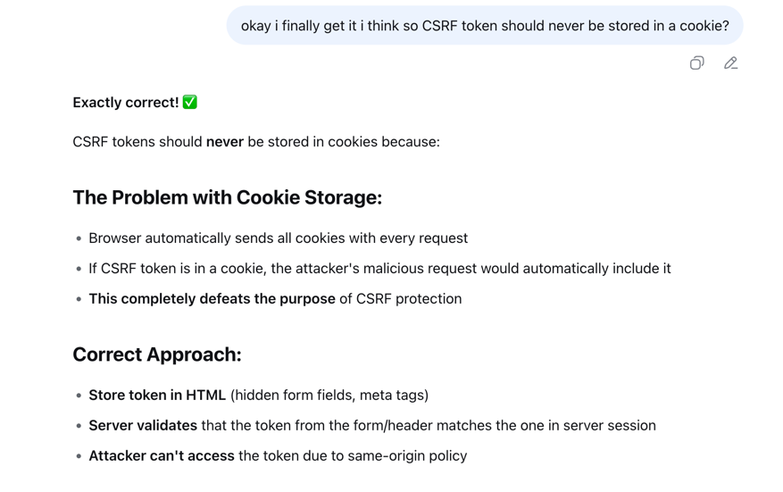

# Elective Security for Web Developers

Common problems are in AAA: Authentication, Authorization, Accounting / Auditing.

## CVE vs CWE

### CVE - Common Vulnerabilities and Exposures

- Definition: Public identifier for known cybersecurity vulnerabilities.
- Format: CVE-YYYY-NNNNN (year + unique number).
- Purpose: Standard way to track, share, and reference vulnerabilities across tools and databases.
- Authority: Managed by MITRE, used globally.
- Usage: Security teams use CVEs to patch, monitor, and mitigate risks quickly.
- Severity: Often paired with CVSS scores for impact rating.

---

### CWE Common Weakness Enumeration

- It’s a catalog of software and hardware weaknesses (like insecure coding patterns, design flaws, and
  misconfigurations).
- Managed by MITRE, used worldwide.
- Each weakness has a unique CWE-ID (e.g., CWE-89: SQL Injection).
- Helps developers, testers, and security teams:
    - Classify vulnerabilities (root causes, not just exploits).
    - Prioritize fixes.
    - Map to CVEs (CWE = weakness, CVE = actual instance in a product).

---

### Key difference

**_CWE_** → describes the type of flaw (general category).

**_CVE_** → documents a specific vulnerability in a product/version.

---

<br>

## Cryptography

_Kerckhoffs’s principle_ is a foundational rule in cryptography

`A cryptosystem should remain secure even if everything about the system,
except the secret key, is public knowledge.`

---

<br>

## SQL Injection

For juiceshop if the following is inserted into username/email field login is approved: `' or '1'='1' --`

---

<br>

## Finding third party dependencies for a given web app

The following script makes use of built-in DOM traversal func to quickly generate a list of each script tag imported
into current page.

Go to a website open developer tools in browser, go to console and execute the following code to get all third part
dependencies logged:

```javascript
const scripts = document.querySelectorAll('script');

scripts.forEach(script => {
  if (script.src) {
    console.log(`i: ${script.src}`);
  }
});
```

---

<br>

## ChatGPT on Mediator, Interpreter and Translator

### Mediator 🕹

_ComputerScience_: A design pattern/component that manages communication between modules so they don’t talk to each
other directly.

_Cybersecurity_: Can be a security control/proxy (e.g., WAF, message broker) that regulates interactions to reduce
attack surface.

### Interpreter 📜

CS: Executes code line-by-line without compiling to machine code first (e.g., Python interpreter).

Cybersecurity: A target for injection attacks (e.g., SQL interpreter, command interpreter in shells).

### Translator 🌐

_ComputerScience_: Converts code/data from one representation to another (e.g., compiler translates source code →
machine code, protocol translators).

_Cybersecurity_: May introduce parsing/format-conversion vulnerabilities (e.g., encoding issues, file format exploits).

---

<br>

## Cross Site Scripting XSS

**_React and XSS_**


_Source Deepseek_

**XSS Types:**

1. **Stored (Persistent)**
    - Malicious script stored on server (database)
    - Affects all users who view the infected page
    - Example: Malicious comment in blog post

2. **Reflected (Non-Persistent)**
    - Payload reflected immediately in response
    - Typically via URL parameters or form inputs
    - Requires user to click malicious link

3. **DOM-based**
    - Entirely client-side, payload never sent to server
    - JavaScript writes user input directly to DOM
    - Example: document.write(userInput)

**Key Difference:**

- Stored: Server stores → affects multiple users
- Reflected: Immediate reflection → one-time impact
- DOM-based: Client-side only → stealthier

---

<br>

## XXE (XML External Entity)

- Attacks XML parsers to read local files
- Can lead to file disclosure, SSRF, RCE
- Payload: <!ENTITY xxe SYSTEM "file:///etc/passwd">

---

<br>

### CSRF (Cross-Site Request Forgery)

- Tricks user's browser into making unwanted requests
- Exploits user's active authentication sessions
- Example: Forcing password change via hidden form

#### How CSRF works

_Cross-Site Request Forgery_ (_CSRF_) is an attack that tricks a victim's browser into making unintended requests to a
web application where they're authenticated.
_CSRF_ works because browsers automatically include the user's session cookies with requests to the target site.
An attacker can embed malicious requests in a webpage - such as a form that changes the victim's password or email
address - and when the victim visits that page while logged into the target application, the request executes with their
privileges.

#### How CSRF is prevented

Preventing _CSRF_ primarily involves using _anti-CSRF tokens_. **These are random, unpredictable values generated by the
server and included in _forms_ or _headers_**. When a state-changing request is made, the server verifies the token
matches
what was issued to that session. _SameSite cookies_ provide another layer of defense by restricting when _cookies_ are
sent
with _cross-site requests_. For sensitive actions, re-authentication requirements add additional protection by ensuring
the user consciously confirms critical changes.


_source Deepseek_
---

<br>

## Misc

**_Auth scheme_**


---

### Finding subdomains

- https://archive.org/ -> can be a great tool to lookup through
  sourcecode for a given site which URL schemes are being used.

---

#### Zone Transfer Attacks

A reconnaissance technique targeting misconfigured DNS servers to discover hidden subdomains.
By mimicking authorized _DNS servers_,
attackers request zone transfers - the mechanism DNS uses to synchronize records.

Successful attacks reveal non-public subdomains and DNS configurations without being an actual "hack".
Use `host -t ns target.com` to identify target nameservers.

---

#### Brute Forcing Subdomains

A last-resort reconnaissance technique that tests every possible subdomain combination to discover hidden domains.
It involves generating potential subdomains and asynchronously checking if they resolve to valid IP addresses.

**Key Considerations:**

- Easily detectable and may trigger IP bans
- Slow due to network latency and rate limiting
- Requires asynchronous requests for efficiency
- Should use DNS resolution rather than HTTP requests

**Process**: Generate subdomain guesses → DNS resolve each → Record successful resolutions. Use tools that implement
asynchronous DNS lookups to speed up the process while avoiding detection.

**Dictionary Attacks**

Could also implement Dictionary Attacks where instead of generating all possible subdomains then the most
popular subdomains are chosen from a text file etc.
Just like `Kali 🐲` ships with default `txt` files for plenty _Dictionary Attacks_.

A great tool for this is _**Gobuster**_:

```bash
# Directories/Files
gobuster dir -u http://site.com -w directory-wordlist.txt

# Endpoints (use API-specific wordlists)
gobuster dir -u http://site.com -w /usr/share/wordlists/SecLists/Discovery/Web-Content/common-api-endpoints-mazen160.txt

# Subdomains (different command)
gobuster dns -d site.com -w /usr/share/wordlists/dirbuster/directory-list-2.3-medium.txt
```

---

#### Google subdomains


---

<br>

## TOOLS ⚒️

### ZAP Proxy (by OWASP)

free, open-source web app security scanner.

Acts as a proxy between browser & app.

Lets you intercept, inspect, modify HTTP(S).

Supports scanning, fuzzing, automation.

A free alternative to _Burp Suite_.

---

### Linux Kali 🐉

A Debian-based Linux distro for penetration testing & security auditing.

Preloaded with hacking, forensics, and vulnerability assessment tools.

---

### VMware 💻

Virtualization software to run multiple OSes on one machine.

Used for testing, isolation, and simulating networks safely.

---

### Burp Suite 🕵️

A web security testing toolkit with proxy, scanner, and exploit tools.

Popular for finding web app flaws like XSS, SQLi.

---

### Postman 📬

An API client for building, testing, and debugging APIs.

Automates requests and helps validate backend functionality.

---

<br>

## LINKS

[Am I allowed perform security tests my own servers?](https://www.linode.com/community/questions/24329/am-i-allowed-perform-security-tests-my-own-servers)

[The Transport Layer Security (TLS) Protocol](https://datatracker.ietf.org/doc/html/rfc5246)
